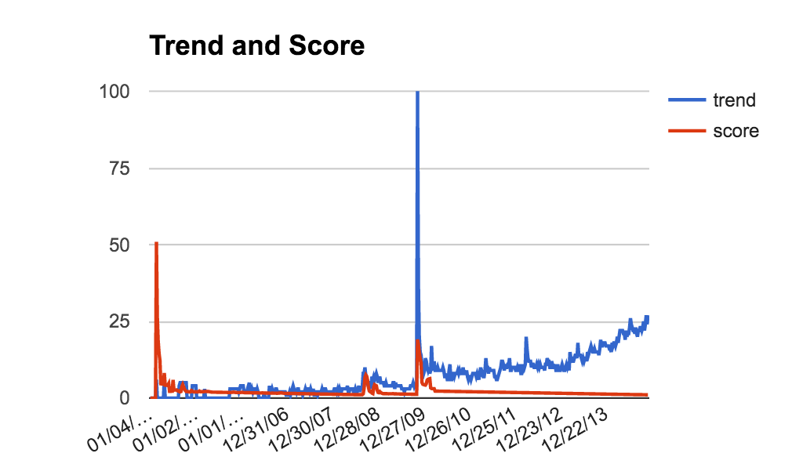
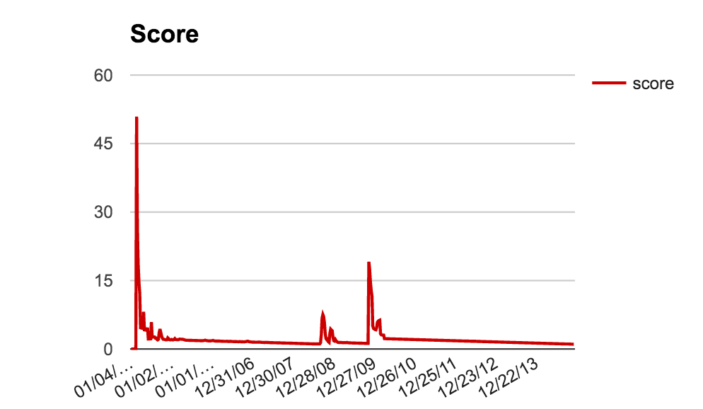
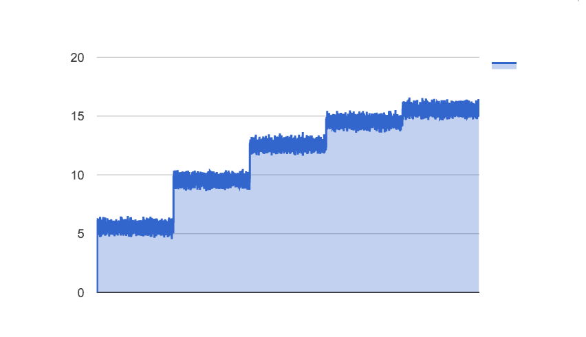
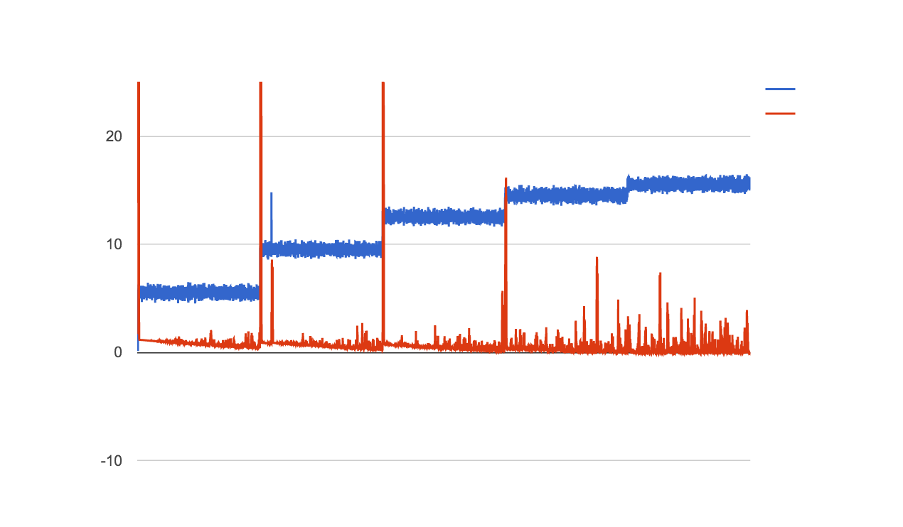

# mruby-changefinder   [](https://travis-ci.org/matsumoto-r/mruby-changefinder)

ChangeFinder class detect change points via continuous outlier and smoothing.

See also [the paper](http://dl.acm.org/citation.cfm?id=775148).

## Sample

- input trend data and output change-point score



- output change-point score only



See also @kentaro 's [blog entry (JA)](http://blog.kentarok.org/entry/2016/03/21/015037).

## install by mrbgems
- add conf.gem line to `build_config.rb`

```ruby
MRuby::Build.new do |conf|

    # ... (snip) ...

    conf.gem :github => 'matsumoto-r/mruby-changefinder'
end
```
## example
```ruby
#
# ChangeFinder.new sdar_order_for_outlier, outlier_discount_param, sdar_order_for_change_point, change_point_discount_param, smooth_term
#
> cf = ChangeFinder.new 5, 0.01, 10, 0.01, 7
 => #<ChangeFinder:0x7fad5c80be50 @ts_data_buffer=[], @change_point_analyze=#<ChangeFinder::SDAR:0x7fad5c80bb80>, @smooth_term=5, @outlier_analyze=#<ChangeFinder::SDAR:0x7fad5c80be20>>
> cf.learn [1,2,1,2,3,2,1,2,1]
 => [6.2017912433901, 1.3973555597559, 2.4211198000217, 2.3979400886673, 1.7835503570548, 1.4166612339939, 1.4837836144657, 1.2835583707215, 1.1556254255408]
> cf.score 1
 => 1.1044914205061
>
```

## Support tools
- create simulation data using ar model, white noise and change points

```
cd misc/
make
```

```
# ./ar number_of_data ar1_coeff ar2_coeff change_point_time change_point_total change_point_decrease expected_value_for_white_noise variance_value_white_noise
./ar 10000 0.6 0.5 2000 5 1 0.0 1.0 > ar.tsv
```

- create graph from `ar.tsv`



- analyze `ar.tsv` by ChangeFinder

```
./mruby/bin/mruby example/cf.rb
ls example/result.tsv
```

- create graph from `result.tsv`


## Simulate data automatically

```
rake check
```

- create graph from `example/result.tsv` using like google docs



## License
under the MIT License:
- see LICENSE file
